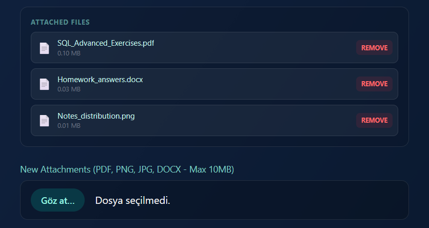

# Task Management System (Full-Stack)

A robust and secure Task Management Web Application built with the **MERN Stack** (MongoDB, Express, React, Node.js). This project features role-based authentication, cloud file storage, dynamic task filtering, and a comprehensive admin dashboard.


## Key Features

### 1. Role-Based Access Control (RBAC)
* **Secure Authentication:** JWT-based login/register system.
* **User Roles:** * **Admin:** Access to system-wide statistics, user management, and task assignment capabilities.
    * **User:** Can only manage and view their own tasks.
* **Protection:** Routes are protected both on Frontend (Higher-Order Components) and Backend (Middleware).

### 2. Cloud File Management (AWS S3)
* Integrated **AWS S3** for secure and scalable file storage.
* Users can upload multiple attachments (PDF, PNG, JPG) to tasks.
* **Constraints:** File type validation and 10MB size limit per file.
* **Action:** Upload, view, download, and delete files directly from the UI.

### 3. Dynamic Dashboard & Filtering
* **Real-time Filtering:** Filter tasks by **Category** (Work, Personal, etc.) and **Status** (Pending, Completed).
* **Deadline Alerts:** Visual cues (Red/Yellow colors) for approaching deadlines.
* **Status Updates:** Visual feedback for completed tasks (line-through, opacity change).

### 4. Admin Analytics
* Visual distribution of tasks (Completed vs. Pending).
* Real-time counters for total users and active tasks.

---

## Screenshots

### Dynamic Filtering
The dashboard allows users to filter tasks instantly.

| All Tasks View | Filtered View (Completed) |
|:---:|:---:|
|  |  |
| *Full list of tasks* | *Filtered by 'Completed' status* |

### Admin Statistics & Distribution
Admins have access to a dedicated panel to monitor system load.


### File Attachment Module
Secure file upload interface with validation.



---

## Tech Stack

* **Frontend:** React.js, Tailwind CSS, Axios
* **Backend:** Node.js, Express.js
* **Database:** MongoDB, Mongoose
* **Storage:** AWS S3, Multer
* **Testing:** Jest, Supertest
* **Security:** JWT, Bcrypt, CORS

---

## Installation & Setup

1.  **Clone the repository**
    ```bash
    git clone https://github.com/sozdemir53/task-management.git
    cd task-management
    ```

2.  **Install Dependencies**
    * Backend:
        ```bash
        cd backend
        npm install
        ```
    * Frontend:
        ```bash
        cd frontend
        npm install
        ```

3.  **Environment Variables (.env)**
    Create a `.env` file in the `backend` folder and add the following:
    ```env
    PORT=5000
    MONGO_URI=your_mongodb_connection_string
    JWT_SECRET=your_jwt_secret_key
    AWS_ACCESS_KEY_ID=your_aws_access_key
    AWS_SECRET_ACCESS_KEY=your_aws_secret_key
    AWS_REGION=your_aws_region
    S3_BUCKET_NAME=your_bucket_name
    ```

4.  **Run the Application**
    * Backend: `npm run dev`
    * Frontend: `npm run dev`

---

## Testing

The backend API is fully tested using **Jest** and **Supertest**.
To run the test suite:

```bash
cd backend
npm test

Test Coverage:
 * User Registration & Login
 * Task CRUD Operations
 * Security Checks (Invalid Token, Wrong Password)
 * Admin Role Verification

```
---

## Contributors
This project was developed as a collaborative team effort.
* [Sevgi Yaren Özdemir](https://github.com/sozdemir53)
* [Zehra Gül Özdemir](https://github.com/zehrose)
* [Nur Albina Özdil](https://github.com/NurAlbina)
* ## 👩‍💻 My Key Contributions (NurAlbina)
As a core developer of this team project, I designed and implemented the following critical modules:

* **Role-Based Authorization (RBAC):** Built the security layer using JWT and middleware to separate Admin/User privileges. (Commit: `FEAT: Role-based authorization system`)
* **Admin Dashboard:** Developed the admin interface for managing users and viewing system statistics. (Commit: `FEAT: Admin Panel UI`)
* **File Management Infrastructure:** Implemented the backend logic for file uploads using AWS S3 and Multer. (Commit: `Backend file upload infrastructure`)
* **Secure Routing:** Created the `ProtectedRoute` component to secure application routes. (Commit: `FIX: Korumalı rota`)

## License
This project is licensed under the MIT License.
